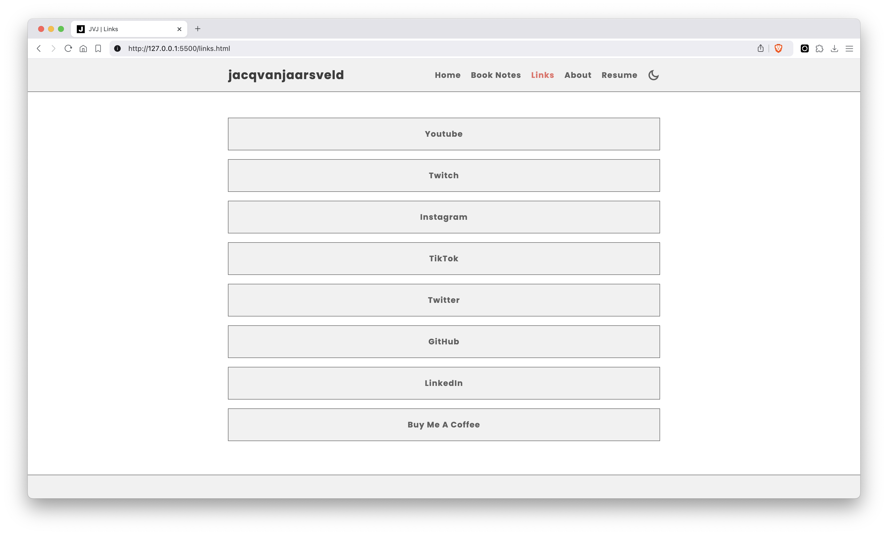
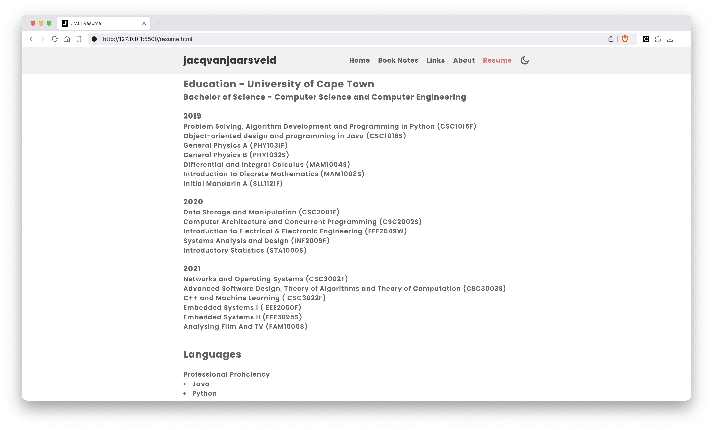

# Archived Personal Website

This repository contains the code for my first personal website, which I developed to enhance my front-end development skills using HTML, CSS, and JavaScript. Although this site is no longer in use, it served as a valuable project in my learning journey about web hosting, DNS records, and related topics.

## Features

- **Home Page**: Introduced who I am and what I do.
- **About Page**: Shared personal details, skills, and interesting facts about me.
- **Resume Page**: Highlighted my educational background, languages, skills, and personal projects.
- **Social Links**: Connected visitors to my various social media accounts and platforms.
- **Book Notes Page**: Contained notes and insights from books I read, starting with *Atomic Habits*.

## Technologies Used

- **HTML**: Structure of the web pages.
- **CSS**: Styling and layout.
- **JavaScript**: Interactivity and dynamic elements.
- **Font and Icon Libraries**: Enhanced visual appeal with custom fonts and icons.

## Note

This repository's content has been migrated to the Ghost CMS platform, allowing for a more dynamic and blog-focused experience. This repository is for reference.

## Screenshots

Here are some screenshots of the website:

- The home page.

- My book notes page.

- Notes on Atomic Habits by James Clear.

- My personal links.

- My about page.

- My simple resume.

